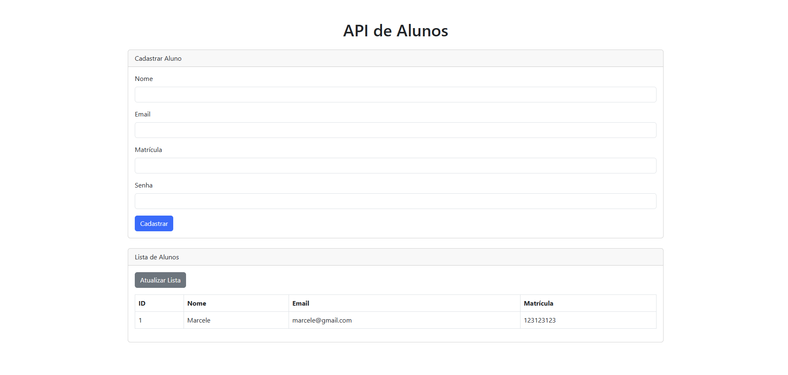

# Projeto: API de Alunos com Frontend em HTML e Bootstrap

Este projeto consiste em uma API desenvolvida com Flask para gerenciar alunos e um frontend simples em HTML e Bootstrap para consumir a API.

---



---

## 📋 Funcionalidades

### Backend (API)
- **Cadastrar Aluno**: Endpoint para cadastrar um novo aluno no banco de dados.
- **Listar Alunos**: Endpoint para listar todos os alunos cadastrados com suporte à paginação.
- **Página Inicial**: Endpoint para exibir uma mensagem de boas-vindas.

### Frontend
- **Formulário de Cadastro**: Permite cadastrar novos alunos.
- **Lista de Alunos**: Exibe os alunos cadastrados em uma tabela com a opção de atualizar a lista.

---

## 🛠️ Tecnologias Utilizadas

### Backend
- **Python**: Linguagem de programação.
- **Flask**: Framework para desenvolvimento da API.
- **Flask-CORS**: Para lidar com problemas de CORS.
- **MySQL**: Banco de dados para armazenar os dados dos alunos.
- **bcrypt**: Para hashing de senhas.
- **python-dotenv**: Para gerenciar variáveis de ambiente.

### Frontend
- **HTML**: Estrutura da página.
- **Bootstrap**: Estilização e layout responsivo.
- **Axios**: Biblioteca para realizar requisições HTTP.

---

## 🚀 Como Executar o Projeto

### Pré-requisitos
- Python 3.10 ou superior instalado.
- MySQL instalado e configurado.
- Node.js (opcional, para instalar dependências do frontend, se necessário).

### Configuração do banco de dados

1. **Crie o banco de dados e a tabela no MySQL executando as seguintes queries**

   ```sql
   CREATE DATABASE escola;

   USE escola;

   CREATE TABLE aluno (
       id INT AUTO_INCREMENT PRIMARY KEY,
       nome VARCHAR(100) NOT NULL,
       email VARCHAR(100) NOT NULL,
       matricula VARCHAR(50) NOT NULL,
       senha VARCHAR(255) NOT NULL
   );
   ```

2. **Configure as variáveis de ambiente no arquivo `.env`**
        
   ```
   DB_HOST=localhost
   DB_USER=seu_usuario
   DB_PASSWORD=sua_senha
   DB_NAME=escola
   ```


### Configuração do Backend

1. **Clone o repositório**:
   ```bash
   git clone <URL_DO_REPOSITORIO>
   cd backend
   ```

2. **Instale as dependências**:
   ```bash
   pip install -r requirements.txt
   ```

3. **Configure o banco de dados**:
- Crie um banco de dados no MySQL.
- Configure as variáveis de ambiente no arquivo .env:
```bash
DB_HOST=localhost
DB_USER=seu_usuario
DB_PASSWORD=sua_senha
DB_NAME=nome_do_banco
```
4. **Execute o backend**:
```bash
python app.py
```

5. **O backend estará disponível em http://127.0.0.1:5000**.

### Configuração do Frontend

1. **Acesse a pasta do frontend:**
```bash
cd frontend
```

2. Abra o arquivo ```index.html``` no navegador.

## 📚 Endpoints da API

 1. **Cadastrar Aluno**

- URL: /alunos
- Método: POST
- Body:
```json
{
  "nome": "João",
  "email": "joao@email.com",
  "matricula": "12345",
  "senha": "senha123"
}
```

- Resposta:
```json
{
  "message": "Aluno cadastrado com sucesso!"
}
```

2. **Listar alunos**

- URL: /alunos
- Método: GET
- Parâmetros:
   - page (opcional): Número da página (padrão: 1).
   - per_page (opcional): Número de alunos por página (padrão: 10).

- Resposta:
```json
[
  {
    "id": 1,
    "nome": "João",
    "email": "joao@email.com",
    "matricula": "12345"
  },
  ...
]
```

3. **Página inicial alunos**

- URL: /
- Método: GET
- Resposta:
```json
{
  "message": "Bem-vindo à API de Alunos!"
}
```

### 🐛 Possíveis Problemas e Soluções

1. **Erro de CORS**
Certifique-se de que o flask-cors está instalado e configurado no backend.

2. **Erro ao Conectar ao Banco de Dados**
Verifique as credenciais no arquivo .env.
Certifique-se de que o MySQL está rodando.


